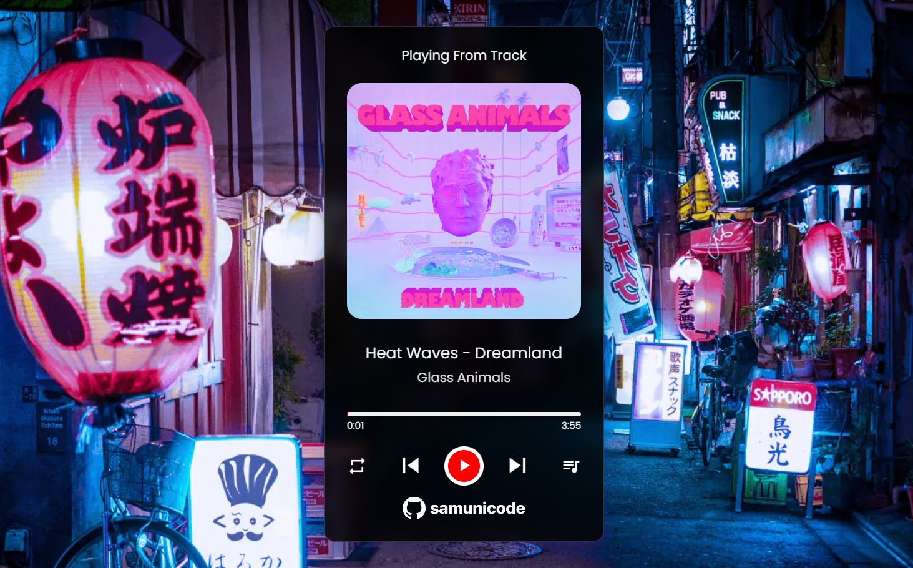

# Music Player

- A simple HTML, CSS, and JavaScript music player that includes features like looping, repeating, and shuffle as well as play/pause and play next/previous tracks. 
- In addition to knowing which music is currently playing, you can choose songs from the preloaded list.
- For icons, I have used [Material UI Icons](https://fonts.google.com/icons).
- Access the Music Player from [here](https://samunicode.github.io/Music-Player/)

## Screenshots

## 🔗 Reach out to me at:

